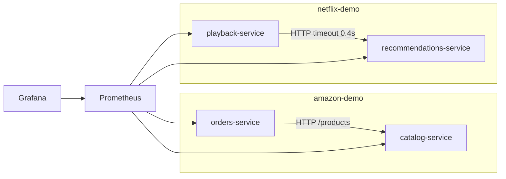

# Architecture

Two case studies share one kind cluster named `ca2` and stay in separate namespaces.

## Amazon

catalog owns the product list (`GET /products`). orders owns `POST /orders` and `GET /orders` and calls catalog at `http://catalog-service.amazon-demo.svc.cluster.local:8080`. There is no shared database and no shared Python module. Each service has its own Deployment (3 replicas, `maxSurge: 1`, `maxUnavailable: 0`), its own Service, and its own image.

A rolling update changes the orders pod template only. The catalog pods recorded in `docs/evidence/amazon-rollout.txt` kept the same start time and zero restarts.

## Netflix

playback calls `recommendations-service` with `REC_TIMEOUT=0.4`. On timeout or connection failure it returns HTTP 200, `"degraded": true`, and a fixed fallback list. That is graceful degradation, not a full circuit breaker: there is no open/half-open state machine, and the next request tries recommendations again.

Pods in this namespace carry `chaos=enabled`. `netflix/chaos/chaos_monkey.py` will only delete a Running pod in `netflix-demo` with that label, and only when `--execute` is passed.

## Runtime shape of every service

Each container is a multi-stage Python 3.12 image, runs as uid 10001, and serves gunicorn with one worker so the Prometheus client does not need a multiprocess directory. Every service exposes `/health`, `/version` (from `APP_VERSION`), `/metrics`, `/slow?ms=`, and `/error`. The metrics are `http_requests_total{service,method,path,status}` and `http_request_duration_seconds`. Scrapes of `/metrics` are not counted, so the dashboard is not dominated by Prometheus itself.

`FAIL_READY=1` makes `/health` return 503. The bad-revision demos use that to stall a rollout without killing the pods that are still ready.

## Monitoring

kube-prometheus-stack release `monitoring` in namespace `monitoring`, chart version pinned in the install command to 91.8.2. ServiceMonitors live next to each case study and select the Service port named `http`. Dashboards are JSON under `monitoring/grafana/` and are applied as ConfigMaps labeled `grafana_dashboard=1`.
