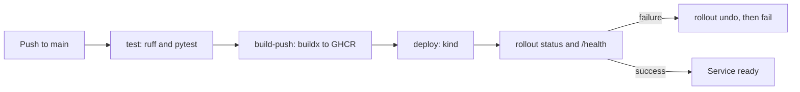

# Pipeline

Both workflows use the same three jobs. Amazon is path-filtered to `amazon/**` and Netflix to `netflix/**`. Triggers are push to `main`, pull request, and `workflow_dispatch`.

Source: `docs/diagrams/pipeline.mmd`. A PNG export with mermaid-cli was tried once and failed: the Windows `npx` on this machine cannot read the WSL path. Screenshot the diagram from the rendered README on GitHub.

## Jobs

1. **test.** Matrix over the two services. `actions/setup-python@v7` uses Python 3.12. `ruff check` and `pytest` run in that service directory.
2. **build-push.** `docker/setup-buildx-action@v4`, `docker/login-action@v4`, `docker/build-push-action@v7`. Images go to `ghcr.io/<owner>/amazon-<service>` or `netflix-<service>` with the commit SHA and `latest`. Pull requests build and do not push. The workflow permission is `packages: write` and the password is `GITHUB_TOKEN`.
3. **deploy.** Runs on push and `workflow_dispatch` only. `helm/kind-action@v1` creates a kind cluster with `kindest/node:v1.37.0`. The job pulls the SHA tag, retags it to the local name in the manifest (`amazon-catalog:v1` and so on), `kind load`s it, applies the namespace and Deployments, waits for `rollout status`, and execs a `/health` check. If that step fails, the next step runs `kubectl rollout undo` and exits 1.

Action major versions were taken from each repo's latest release on 1 Oct 2026. Each action's `runs.using` is `node24`, which is what avoids the Node 20 deprecation warning.

Pull requests do not deploy, because the image is not pushed and a kind deploy from an untrusted fork should not receive `packages: write`.

## Local versus CI

Local manifests use `imagePullPolicy: IfNotPresent` and images loaded with `kind load`. CI does the same after pulling from GHCR, so the manifest files do not contain a registry hostname. The registry name is only in the workflow.
